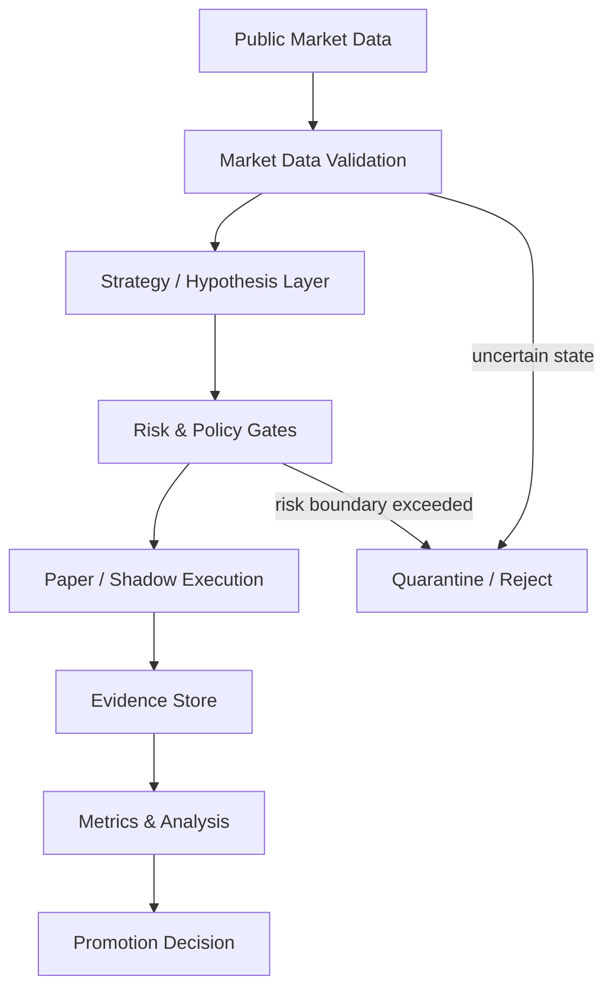
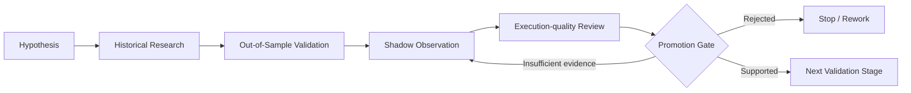

# Trading Systems Research

A public, sanitized case study of a personal trading-systems research project.

The private implementation explores how market-data quality, strategy hypotheses, execution assumptions, risk controls, and evidence-based promotion decisions interact in an automated trading environment.

This repository intentionally publishes the **engineering approach and research workflow**, not the strategy IP, live integration details, account data, or private market logs.

## Why I built this

I wanted to understand trading systems as an engineering problem, not just a backtesting problem.

A profitable backtest alone does not prove that a strategy is robust. Real systems must also deal with:

- incomplete or stale market data
- ambiguous execution evidence
- fees, slippage, and timing uncertainty
- risk limits and position constraints
- reproducible experiments
- long-running observation and restart behaviour
- clear promotion criteria before moving to the next validation stage

The project therefore separates **research**, **shadow observation**, **execution simulation**, **risk controls**, and **promotion decisions**.

## High-level architecture

See [docs/architecture.md](docs/architecture.md).

## Research workflow

The principle is simple:

> **No strategy is promoted only because one backtest looks good.**

See [docs/research-workflow.md](docs/research-workflow.md).

## Reliability principle: fail closed

When evidence is incomplete, the system prefers to reject or quarantine the observation rather than silently treat it as valid.

Conceptual examples:

| Condition | Behaviour |
| --- | --- |
| stale market data | reject |
| sequence/data gap | quarantine |
| incomplete local state | do not evaluate |
| ambiguous execution evidence | exclude from authoritative outcome |
| risk boundary exceeded | block action |
| interrupted run | preserve uncertainty rather than inventing a result |

See [docs/risk-and-validation.md](docs/risk-and-validation.md).

## What is measured

The private implementation records structured evidence for areas such as:

- market-data freshness and continuity
- strategy decisions and rejection reasons
- paper/shadow order lifecycle
- modeled execution costs
- risk-state transitions
- experiment outcomes
- censored or ambiguous observations
- run health and restart behaviour

A sanitized example is available in [examples/sanitized-event.json](examples/sanitized-event.json).

## Engineering decisions

The project uses several design ideas that I found especially important:

- separate authoritative evidence from convenience views
- keep research hypotheses separate from execution assumptions
- make uncertain outcomes explicit
- record enough context to reproduce decisions
- prefer small, testable components over one large trading loop
- freeze experiment rules before evaluating results
- use explicit promotion criteria rather than subjective judgement

See [docs/engineering-decisions.md](docs/engineering-decisions.md).

## Technology used in the private implementation

At a high level:

- Python
- WebSocket and REST market-data clients
- SQLite
- JSONL audit journals
- local dashboards and reporting
- automated unit tests
- deterministic simulations
- long-running shadow/paper observation

Exact implementation details are intentionally omitted from this public repository.

## What is intentionally private

The following are **not** published here:

- strategy source code
- exact entry/exit rules
- thresholds and parameters
- current experimental variants
- live or demo execution integration
- API signing or credential-handling code
- real market logs and databases
- account/order identifiers
- private research datasets
- detailed profitability results
- unpublished promotion thresholds

This boundary is deliberate: the goal of this repository is to demonstrate **systems thinking, experimentation discipline, data integrity, and engineering judgement** without exposing sensitive research or operational details.

## What I learned

This project changed how I think about automated trading.

The difficult part is not only generating a signal. It is deciding whether the data is trustworthy, whether an apparent fill is actually supported by evidence, whether modeled costs are realistic, whether the experiment is mature enough to interpret, and whether the result should be promoted at all.

That mindset has become as important to me as the code itself.

## Repository purpose

This is a portfolio case study, not a trading product and not financial advice.

The full implementation remains private.
