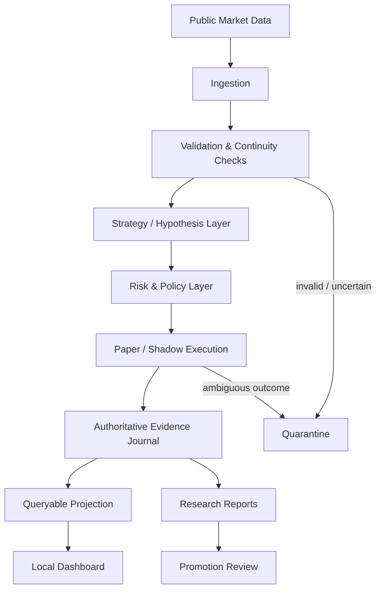

# Architecture

This document describes the public, sanitized architecture of the private trading-systems research project.

It intentionally stays one abstraction level above the implementation.

## System view

## Main responsibilities

### 1. Market-data ingestion

The private implementation consumes public market data through streaming and request/response interfaces.

The public design only assumes that incoming data may be delayed, duplicated, incomplete, out of sequence, or temporarily unavailable.

### 2. Validation layer

Before strategy logic trusts the data, validation checks whether the local view is sufficiently consistent.

Examples include:

- freshness
- ordering
- continuity
- expected stream presence
- recovery after disconnects
- consistency between independent observations

Exact thresholds are private.

### 3. Strategy / hypothesis layer

Research hypotheses are intentionally separated from infrastructure and execution logic.

That separation makes it easier to:

- compare hypotheses consistently
- freeze detector rules before evaluation
- prevent infrastructure changes from silently changing research meaning
- reuse the same evidence pipeline across experiments

### 4. Risk and policy layer

A strategy idea does not automatically become an action.

The risk/policy layer may block or constrain it based on system state, exposure, data quality, or other hard boundaries.

This layer is designed to fail closed.

### 5. Paper / shadow execution

The project distinguishes between:

- market observation
- strategy intent
- simulated/paper execution evidence
- real exchange action

Research stages can therefore progress without assuming that every theoretical touch would have produced a real fill.

### 6. Evidence store

The private implementation keeps an append-oriented authoritative event journal and a query-friendly local projection.

This provides two different guarantees:

- **authoritative history** for audit/replay
- **convenient queries** for dashboards and analysis

The query projection is treated as rebuildable; it is not the source of truth.

### 7. Metrics and reporting

Reports aggregate:

- experiment outcomes
- rejection/censoring reasons
- execution assumptions
- cost assumptions
- system incidents
- maturity indicators

The reporting layer should make uncertainty visible rather than hiding it.

## Design objective

The architecture is built around a single question:

> Can I explain why the system made a decision, what evidence it relied on, and whether that evidence was trustworthy?

If the answer is no, the result should not be treated as authoritative.
