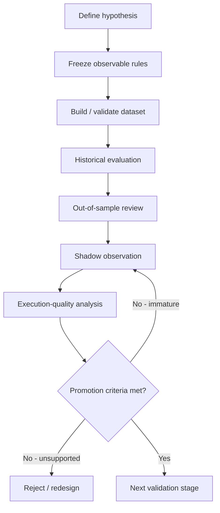

# Research Workflow

The project treats trading strategy development as an evidence pipeline.

## Workflow

## 1. Define the hypothesis

A hypothesis should describe a market behaviour that can be observed without using future information.

The project tries to distinguish:

- the market pattern being tested
- the entry/exit assumptions
- transaction-cost assumptions
- execution assumptions

These should not be collapsed into one opaque backtest.

## 2. Freeze the rules

Before evaluating a hypothesis, the relevant rules are frozen for that experiment.

This reduces the risk of unconsciously changing parameters after seeing the outcome.

## 3. Validate the data

Missing or inconsistent data is not silently filled in.

Depending on the experiment, affected observations may be:

- rejected
- censored
- marked ambiguous
- excluded from authoritative metrics

## 4. Separate development and evaluation evidence

Historical research may be split in time so later observations are not used to design earlier rules.

The exact private split rules and promotion thresholds are intentionally not published here.

## 5. Observe in shadow mode

A hypothesis that survives historical evaluation can be observed against new market data without assuming that it should immediately trade.

Shadow observation helps answer different questions:

- does the detector behave as expected?
- are signals generated at plausible times?
- do data gaps affect interpretation?
- how often would execution assumptions become ambiguous?

## 6. Review execution quality

A theoretical price touch is not automatically treated as a reliable fill.

Execution analysis can distinguish between:

- stronger evidence
- weaker/ambiguous evidence
- censored outcomes
- missing-data cases

This prevents optimistic execution assumptions from leaking into strategy evaluation.

## 7. Promotion gate

Promotion is based on explicit evidence rather than a single headline metric.

A mature gate can consider areas such as:

- sufficient valid observations
- positive net evidence after modeled costs
- robustness to sensitivity checks
- uncertainty ranges
- execution quality
- operational reliability

Exact private thresholds are omitted.

## Key lesson

The workflow is deliberately conservative.

A result can be interesting without being ready for promotion.
